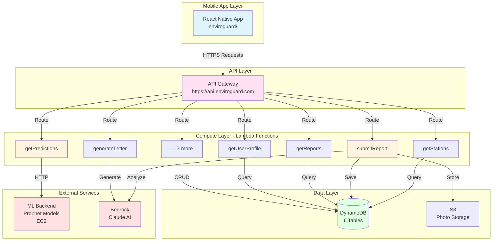
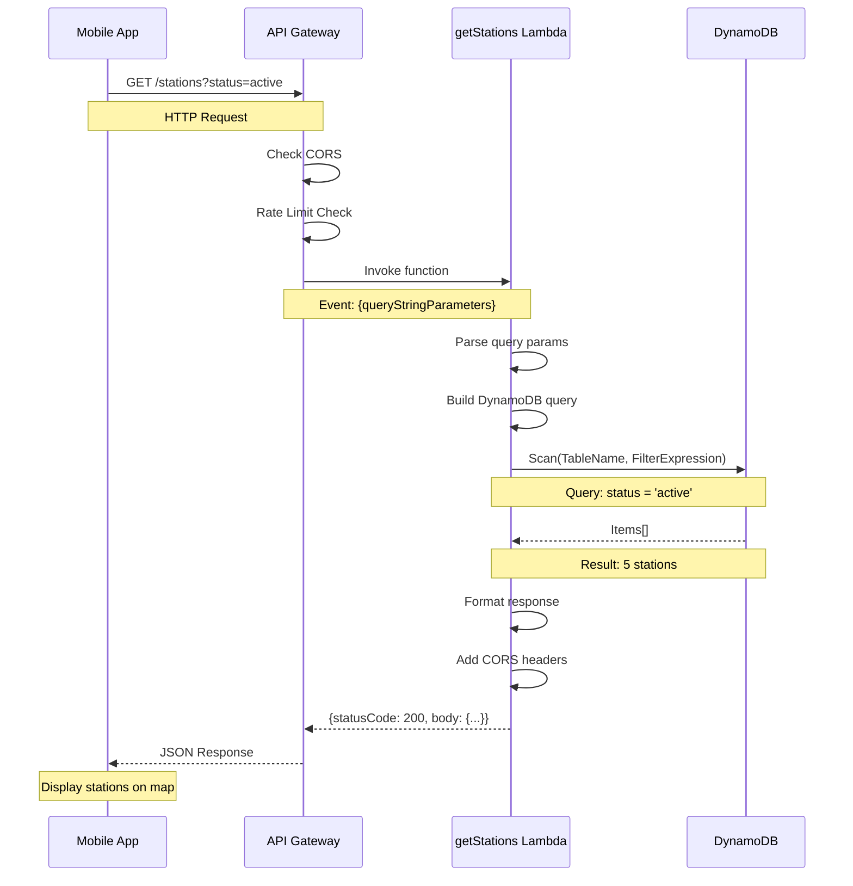
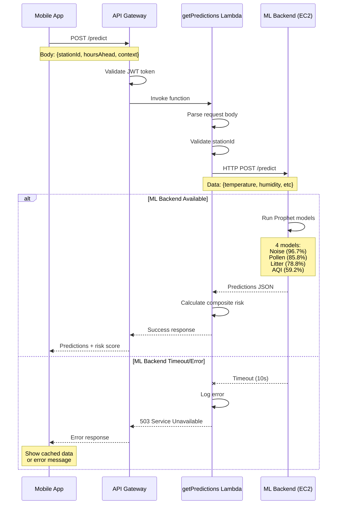
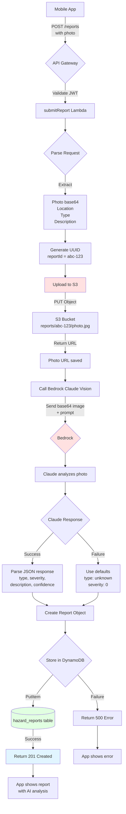
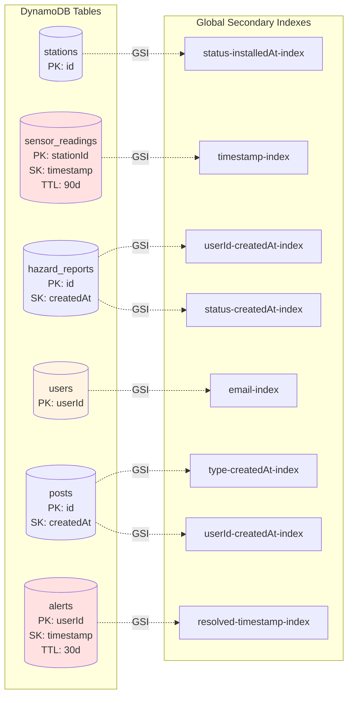
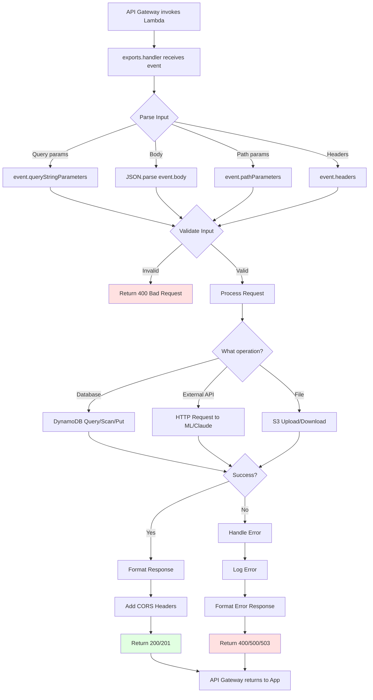
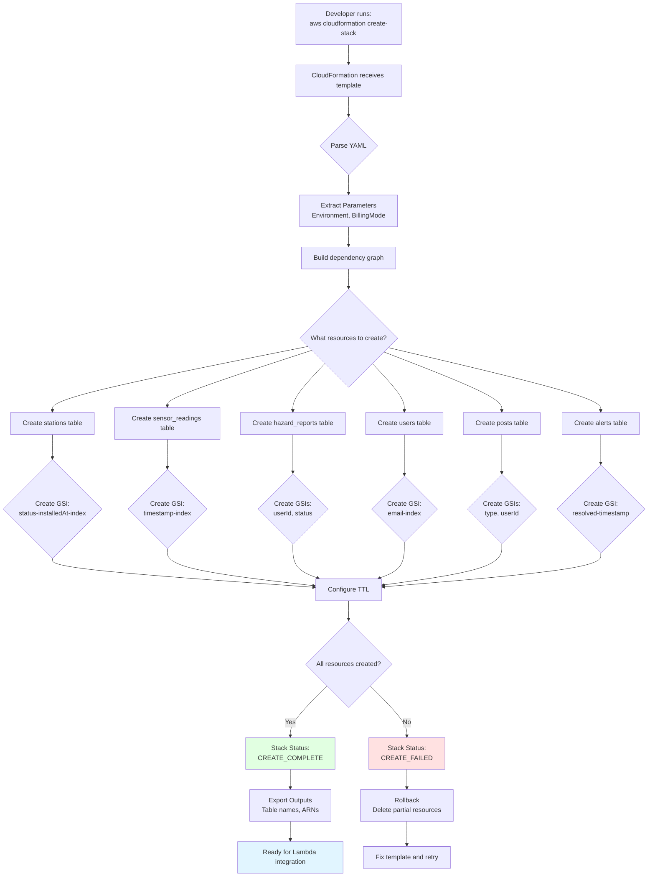
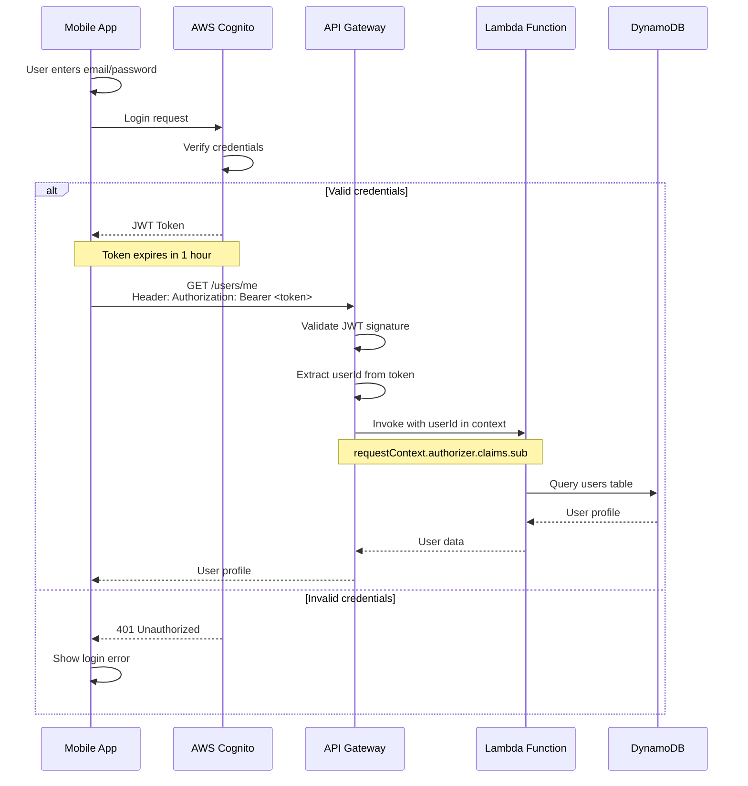
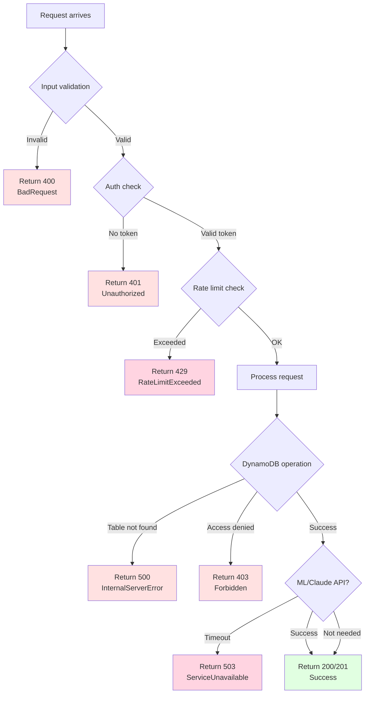

# EnviroGuard Architecture Flowcharts

Visual diagrams explaining the system architecture and data flows.

---

## 1. Overall System Architecture



---

## 2. Request Flow: GET /stations



**Time: ~100-300ms**

---

## 3. Request Flow: POST /predict (ML Integration)



**Time: ~2-10 seconds** (ML computation is expensive)

---

## 4. Request Flow: POST /reports (Photo + Claude Vision)



**Time: ~3-8 seconds** (Claude Vision analysis takes time)

---

## 5. Database Structure (DynamoDB Tables)



**Note:** Red = TTL enabled, Yellow = Contains PII

---

## 6. Lambda Function Internal Flow



---

## 7. CloudFormation Deployment Flow



**Time: ~5 minutes** to create all 6 tables + indexes

---

## 8. Authentication Flow (Future)



---

## 9. Error Handling Flow



---

## 10. Data Flow: Complete User Journey

```mermaid
flowchart TB
    START[User opens app] --> A1[App loads]
    
    A1 --> B1{User logged in?}
    B1 -->|No| C1[Show login screen]
    B1 -->|Yes| D1[Load user profile<br/>GET /users/me]
    
    C1 --> C2[User logs in]
    C2 --> D1
    
    D1 --> E1[Load saved locations<br/>from profile]
    
    E1 --> F1[Display Map tab]
    F1 --> F2[GET /stations<br/>for map area]
    F2 --> F3[Show stations<br/>as markers]
    
    F3 --> G1{User clicks station}
    G1 --> G2[GET /readings/station-001]
    G2 --> G3[Show sensor data<br/>in bottom sheet]
    
    G3 --> H1{User switches to<br/>Health tab}
    H1 --> H2[POST /predict<br/>Get 24h predictions]
    H2 --> H3[Call ML Backend<br/>Prophet models]
    H3 --> H4[Display forecast<br/>timeline]
    
    H4 --> I1{Prediction > threshold?}
    I1 -->|Yes| I2[Create alert<br/>POST /alerts]
    I1 -->|No| I3[No action]
    
    I2 --> J1[Send push notification]
    I3 --> K1{User switches to<br/>Report tab}
    J1 --> K1
    
    K1 --> K2[GET /reports<br/>nearby reports]
    K2 --> K3[Display report cards]
    
    K3 --> L1{User taps<br/>+ button}
    L1 --> L2[Open camera]
    L2 --> L3[User takes photo]
    L3 --> L4[POST /reports<br/>with photo]
    
    L4 --> L5[Upload to S3]
    L5 --> L6[Claude Vision analysis]
    L6 --> L7[Store in DynamoDB]
    L7 --> L8[Show report<br/>with AI insights]
    
    L8 --> M1{User switches to<br/>Community tab}
    M1 --> M2[GET /posts<br/>community feed]
    M2 --> M3[Display posts & events]
    
    M3 --> N1{User taps<br/>Generate Letter}
    N1 --> N2[Select station<br/>& recipient]
    N2 --> N3[POST /generate-letter]
    N3 --> N4[Claude Streaming<br/>generates letter]
    N4 --> N5[User edits & exports PDF]
    
    style F3 fill:#e1f5ff
    style H4 fill:#e1ffe1
    style I2 fill:#ffd4e1
    style L8 fill:#fff4e1
    style N5 fill:#e1f5ff
```



---

## ASCII Version (For Terminal/Plain Text)

### Overall Architecture (Simplified)

```
┌─────────────────────────────────────────────────────┐
│                 Mobile App (React Native)           │
│              enviroguard/ (25% complete)            │
└────────────────────┬────────────────────────────────┘
                     │ HTTPS
                     ▼
┌─────────────────────────────────────────────────────┐
│              API Gateway (AWS)                      │
│         https://api.enviroguard.com/v1              │
└──┬──────┬──────┬──────┬──────┬──────┬──────┬───────┘
   │      │      │      │      │      │      │
   ▼      ▼      ▼      ▼      ▼      ▼      ▼
┌─────┐┌─────┐┌─────┐┌─────┐┌─────┐┌─────┐┌─────┐
│ L1  ││ L2  ││ L3  ││ L4  ││ L5  ││ L6  ││ ... │  Lambda
│get  ││get  ││sub  ││get  ││gen  ││get  ││(13) │  Functions
│Stn  ││Pred ││Rpt  ││Rpts ││Ltr  ││User ││     │
└──┬──┘└──┬──┘└──┬──┘└──┬──┘└──┬──┘└──┬──┘└─────┘
   │      │      │      │      │      │
   ▼      ▼      ▼      ▼      ▼      ▼
┌──────────────────────────────────────────────┐
│           DynamoDB (6 Tables)                │
│  stations, readings, reports, users,         │
│  posts, alerts                               │
└──────────────────────────────────────────────┘

   L2 ──────► ML Backend (EC2 - Prophet Models)
   L3 ──────► Bedrock (Claude Vision)
   L5 ──────► Bedrock (Claude Streaming)
```

### Request Flow Example

```
User Action                  System Response
───────────                  ───────────────

1. Open Health tab
       │
       ▼
2. Tap "Get Predictions"
       │
       ▼
3. App sends:               ┌──────────────────┐
   POST /predict            │  API Gateway     │
   {stationId: "001",       │  Receives request│
    hoursAhead: 24}         └────────┬─────────┘
       │                             │
       ▼                             ▼
4. Gateway routes           ┌──────────────────┐
   to Lambda                │ getPredictions   │
       │                    │ Lambda           │
       ▼                    └────────┬─────────┘
5. Lambda calls ML API               │
       │                             ▼
       ▼                    ┌──────────────────┐
6. ML runs 4 Prophet        │ ML Backend (EC2) │
   models                   │ - Noise: 96.7%   │
       │                    │ - Pollen: 85.8%  │
       ▼                    │ - Litter: 78.8%  │
7. Returns predictions      │ - AQI: 59.2%     │
       │                    └────────┬─────────┘
       ▼                             │
8. Lambda formats                    ▼
   response                 ┌──────────────────┐
       │                    │ Calculate        │
       ▼                    │ composite risk   │
9. Returns to app           └────────┬─────────┘
       │                             │
       ▼                             ▼
10. Display forecast        ┌──────────────────┐
    timeline with           │ Return JSON:     │
    predictions             │ {predictions,    │
                            │  compositeRisk}  │
                            └──────────────────┘

Total time: 2-10 seconds (ML computation)
```

### Database Relationships

```
┌─────────────────────┐
│   STATIONS          │
│ ─────────────────── │
│ PK: id              │◄─────┐
│ name                │      │ References
│ location            │      │
│ status              │      │
└─────────────────────┘      │
                             │
┌─────────────────────┐      │
│  SENSOR_READINGS    │      │
│ ─────────────────── │      │
│ PK: stationId       │──────┘
│ SK: timestamp       │
│ noise, trash, etc   │
│ TTL: 90 days        │
└─────────────────────┘

┌─────────────────────┐
│   USERS             │
│ ─────────────────── │
│ PK: userId          │◄─────┐
│ email               │      │
│ healthConditions    │      │
│ alertThresholds     │      │
└─────────────────────┘      │
                             │
┌─────────────────────┐      │
│   HAZARD_REPORTS    │      │ References
│ ─────────────────── │      │
│ PK: id              │      │
│ SK: createdAt       │      │
│ userId              │──────┘
│ location            │
│ photos              │
│ claudeAnalysis      │
└─────────────────────┘

┌─────────────────────┐      ┌─────────────────────┐
│   POSTS             │      │   ALERTS            │
│ ─────────────────── │      │ ─────────────────── │
│ PK: id              │      │ PK: userId          │
│ SK: createdAt       │      │ SK: timestamp       │
│ type (post/event)   │      │ type (noise/etc)    │
│ content             │      │ severity            │
│ likes               │      │ resolved            │
└─────────────────────┘      │ TTL: 30 days        │
                             └─────────────────────┘

PK = Partition Key (Hash Key)
SK = Sort Key (Range Key)
```

---

## Key Insights from Flowcharts

### 1. **Layered Architecture**
- Each layer has single responsibility
- Layers are independent (loose coupling)
- Can replace/upgrade one without affecting others

### 2. **Asynchronous Operations**
- Most operations happen in parallel
- Lambda functions are stateless
- Database queries are concurrent

### 3. **Error Handling at Every Layer**
- Input validation (early failure)
- Graceful degradation (continue without ML if it fails)
- Clear error messages (actionable for user)

### 4. **Scalability**
- API Gateway: Auto-scales
- Lambda: Auto-scales (1 to 1,000,000 concurrent)
- DynamoDB: Auto-scales (on-demand billing)

### 5. **Data Flow**
```
User Input → Validation → Processing → Storage → Response
```
Like a pipeline in physics experiments.

---

## Math/Physics Analogies

### State Transitions
```
σ(state, event) → new_state

Example:
σ(app_idle, "tap_predict_button") → fetching_predictions
σ(fetching_predictions, "ml_success") → showing_forecast
σ(fetching_predictions, "ml_timeout") → error_state
```

### Data Partitioning (DynamoDB)
```
hash(userId) mod N → partition_number

Where N = number of partitions (auto-managed by AWS)
```
Like distributing particles across detector elements.

### Lambda Parallelization
```
If n requests arrive simultaneously:
- Spawn n Lambda instances
- Process in parallel
- Merge results

Similar to parallel computing in physics simulations
```

---

**View these flowcharts on GitHub for better rendering!**
